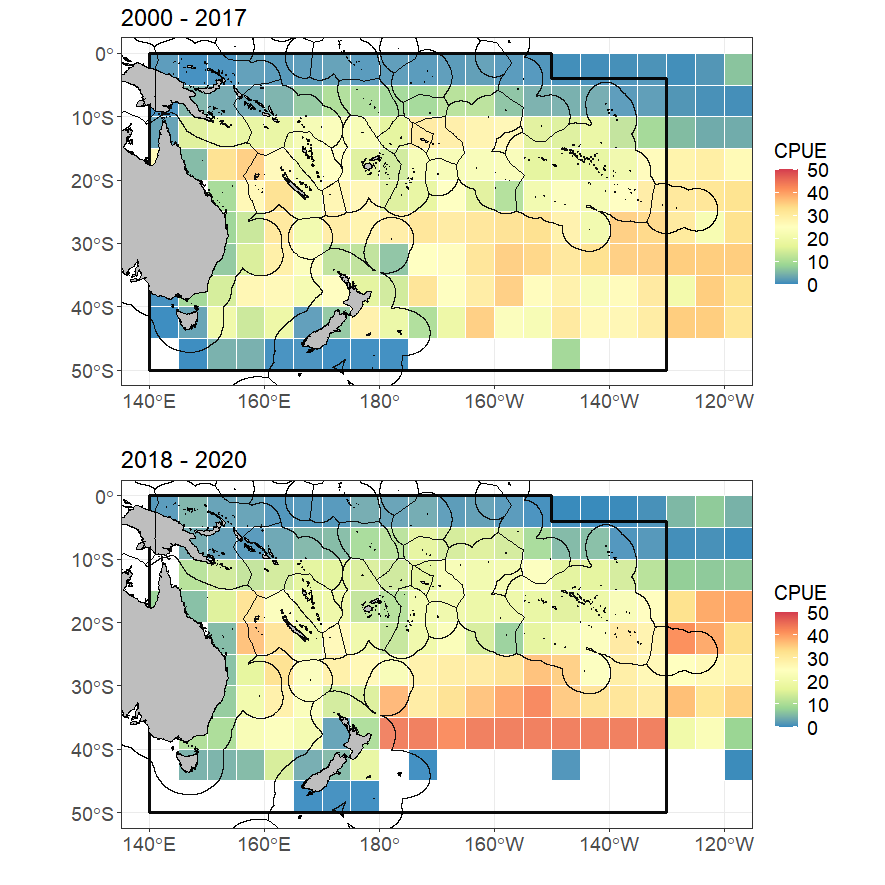

---
output:
  pdf_document:
    extra_dependencies: ["longtable","geometry","lscape"]
  html_document: default
---

```{r setup, include=FALSE}
knitr::opts_chunk$set(echo = TRUE)

library(knitr)
```


\begin{center}

\includegraphics{WCPFC-logo.jpg}
		
		\vskip1cm
		
    {\bfseries
        SCIENTIFIC COMMITTEE\\ \vspace{0.5cm}
        SEVENTEENTH REGULAR SESSION\\}
        \vskip1cm
        Online meeting\\
        \vskip0.3cm
        11--19 August 2021\\
    \vskip1.5cm
		%-----------------------------------------------------------------------------------------
		% Title and document front page
		%\maketitle
		
		
		
		\rule{\textwidth}{1px}\\
		\textbf{Trends in the South Pacific albacore longline and troll fisheries} \\
		\rule{\textwidth}{1px}\\
		


	\end{center}
	
	
\newpage	
	
## Introduction

Write text here.


## Methods

Write text here.

## Results

Write text here.


```{r pressure, echo=FALSE}
plot(pressure)
```
 
## Testing testing

### Subheading example   

Example list:
* Item one
* Item two


<!-- \input{C:/South_Pacific_Albacore/ALB_trends/2021-1/Tables/tableA1_1.tex} Example of using a full path -->   


\newpage
\begin{landscape}
\input{./Tables/tableA1_1.tex}

\end{landscape}

\newpage

```{r,  echo = FALSE, out.width = "90%"}
# Bigger fig.width
# include_graphics("C:/South_Pacific_Albacore/ALB_trends/2021-1/Plots/ALB_CPUE_Maps_WCPFC-CA.png") Example of using a full path

```


## Discussion

Write text here.

## Acknowledgments

Write text here.

## References

Write text here.


